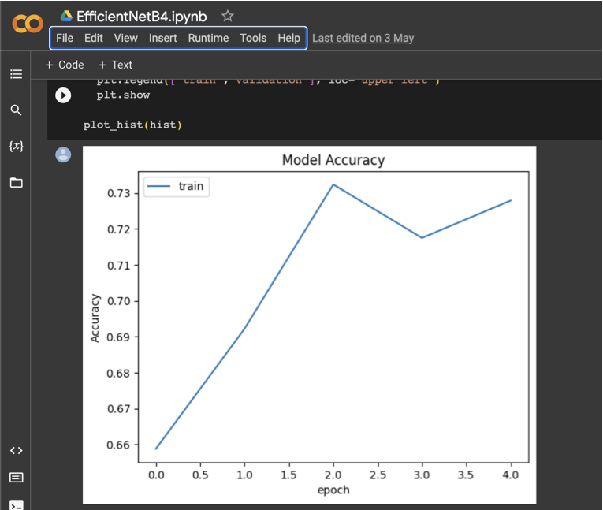
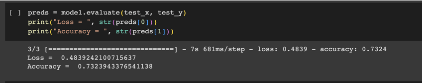

# Lung_Cancer_Detection using Image Processing

I have been using EfficientNetB4 model of Keras which is developed by Google.

The Train and Test result of the data accuracy is up to 70%

# Image of the Train and Test Data

# Limitations:
I have been using google colab free versio, where RAM is limited. That's why I cannot run enough EPOCH, whether data test result would be much higher.